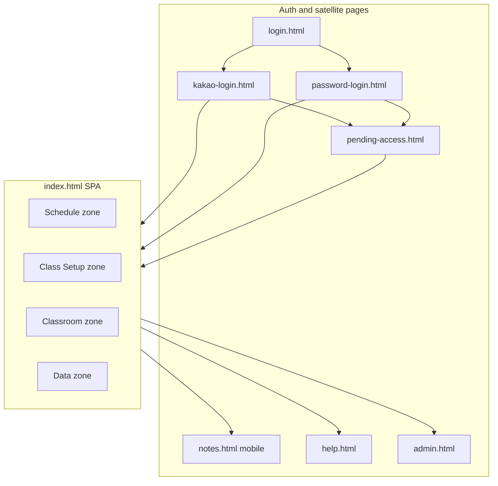
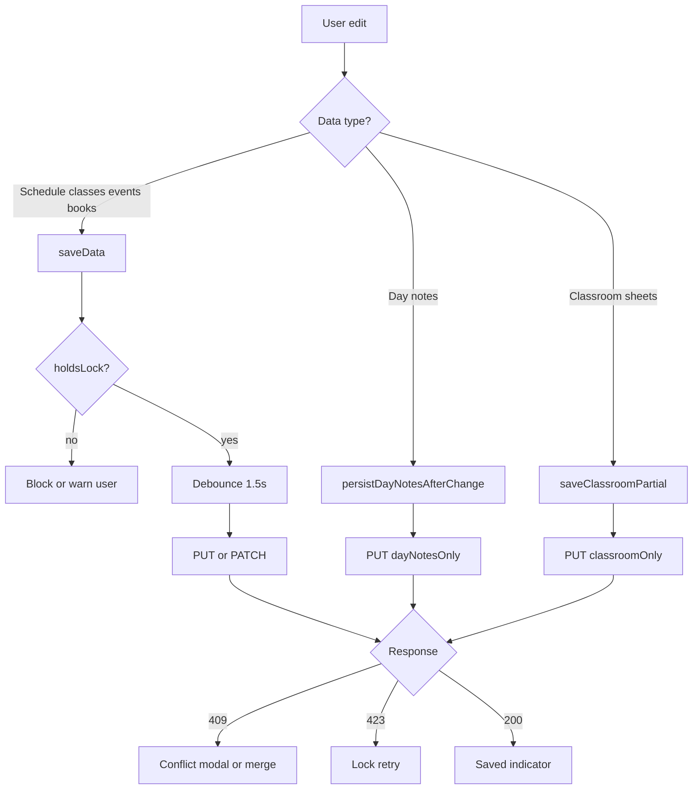

# ClassManager — Scenes & Workflows Design Brief

**Purpose:** Copy-paste companion to [`CLAUDE_DESIGN_BRIEF.md`](CLAUDE_DESIGN_BRIEF.md) for Claude Design, Figma AI, or other design tools.  
**This file answers:** what screens exist, who uses them, how users move through the app, and what states to design.  
**The design brief answers:** colors, typography, components, and shell chrome.

**Keep in sync:** When navigation zones, major panels, or workflows change, update this file alongside [`UI_STYLE_GUIDE.md`](UI_STYLE_GUIDE.md).

---

## How to use with Claude Design

1. Paste **both** files in this order:
   - [`CLAUDE_DESIGN_BRIEF.md`](CLAUDE_DESIGN_BRIEF.md) — visual system
   - This file — scenes and workflows
2. Add your specific request (see [Suggested prompts](#suggested-claude-design-prompts) at the end).
3. **Out of scope for on-screen UI redesign:** syllabus A4 print/PDF layout — see [`Syllabus Style Guide.md`](Syllabus%20Style%20Guide.md).

---

## Product summary

**ClassManager** is a team calendar and curriculum app for teachers (Korean + English UI). Teachers plan terms, manage classes and books, run daily classroom operations (attendance, homework, essays, points), and collaborate on a shared calendar document with edit locks.

**Session length:** Long — users spend hours in calendars, spreadsheets, and editors. Design for clarity, low fatigue, and obvious save/sync state.

**Bilingual:** English and Korean labels appear together. Layouts must tolerate mixed string lengths without breaking zone tabs, segment pills, or table headers.

---

## Personas

| Persona | Primary goals | Typical scenes |
|---------|---------------|----------------|
| **Classroom teacher** | Daily attendance, homework tracking, notes, copy homework text for external sites | Classroom zone, Homework copy, Notes |
| **Curriculum lead** | Books, syllabi, class setup, term events | Class Setup zone |
| **Head teacher / admin** | Cohort board, timetable conflicts, user access, system policy | Cohorts board, Timetable, Admin |
| **New team member** | Get calendar access, learn the app | Auth, Pending access, Help |

---

## Information architecture

### App map



### Main app navigation (SPA)

Three levels inside [`index.html`](index.html), driven by [`app.js`](app.js) `ZONE_SEGMENT_TO_TAB`:

| Zone | Segments | Panel ID |
|------|----------|----------|
| **Schedule** | Calendar, Events, Homework copy, Timetable | `panel-calendar`, `panel-events`, `panel-homework`, `panel-timetable` |
| **Class Setup** | All classes, Cohorts, Books, Syllabi | `panel-classes`, `panel-cohorts`, `panel-curriculum`, `panel-syllabus` |
| **Classroom** | Students, Attendance, Ledger, Homework, Essays, Points, Tests, Notes | 8 panels (`panel-students` … `panel-notes`) |
| **Data** | Data | `panel-data` |

**Hidden/archived segments** (still in DOM): Command Center (`panel-command-center`), Teachers (`panel-teachers`), Portfolio (disabled segment button).

**URL deep links:** `/?zone=schedule&segment=calendar` (zone + segment persist in URL).

### App shell (every SPA scene)

Shared chrome on all `index.html` panels — see shell diagram in [`CLAUDE_DESIGN_BRIEF.md`](CLAUDE_DESIGN_BRIEF.md):

```text
Row 1 — Tools: Calendar menu · Display · Print · Help · Account
Row 2 — Zone tabs: Schedule | Class Setup | Classroom | Data
Row 3 — Segment pills + term summary strip (collapsed term settings by default)
Lock/sync bar — collaborative edit status, saved indicator
Main content — active tab panel
```

---

## Scene catalog

Each scene uses a consistent template. **Scene IDs** are for design requests (e.g. "redesign `SCENE-ATTENDANCE`").

**Data types** (affects edit lock — see [Cross-cutting constraints](#cross-cutting-ux-constraints)):

| Type | Lock required? | Examples |
|------|----------------|----------|
| `calendar` | Yes | Schedule, classes, events, books |
| `dayNotes` | No | Day notes (desktop + mobile) |
| `classroom` | No | Attendance, homework sheets, roster |
| `uiOnly` | No | Filters, view mode — localStorage only |

---

### Auth & onboarding

#### `SCENE-LOGIN-CHOOSER` — Sign-in chooser

| Field | Detail |
|-------|--------|
| **Page** | [`login.html`](login.html) |
| **Entry** | Unauthenticated visit to any protected page; sign-out |
| **Goal** | Choose auth method and device type (personal vs shared computer) |
| **Layout** | Centered card on gray page background |
| **Regions** | 1) Theme/lang toggles (fixed top-right) 2) Title + lead 3) Device type radios 4) Kakao / Password method buttons 5) Mobile notes app link |
| **Actions** | Navigate to Kakao or password login; open mobile notes |
| **Data** | `uiOnly` (device type stored for session policy) |
| **States** | Default; error message from redirect (`loginError`) |
| **Mobile** | Full-width card, stacked buttons |
| **Exit** | `kakao-login.html`, `password-login.html`, `notes.html` |

#### `SCENE-LOGIN-KAKAO` — Kakao OAuth

| Field | Detail |
|-------|--------|
| **Page** | [`kakao-login.html`](kakao-login.html) |
| **Entry** | Login chooser; OAuth error redirect |
| **Goal** | Sign in with Kakao account |
| **Layout** | Centered card (same family as chooser) |
| **Regions** | Device radios, Kakao branded button, back link, error display |
| **Actions** | `GET /api/auth/kakao` → OAuth flow |
| **States** | Loading; OAuth errors (`kakao_mismatch`, `not_invited`, etc.) |
| **Success exit** | `index.html` or `pending-access.html` |

#### `SCENE-LOGIN-PASSWORD` — Email/password

| Field | Detail |
|-------|--------|
| **Page** | [`password-login.html`](password-login.html) |
| **Entry** | Login chooser; password error redirect |
| **Goal** | Sign in with email and password |
| **Layout** | Centered card with form |
| **Regions** | Device radios, email field, password field, submit, error |
| **Actions** | `POST /api/auth/password` |
| **States** | Invalid password, not set, rate limited |
| **Success exit** | `index.html` or `pending-access.html` |

#### `SCENE-PENDING-ACCESS` — Waiting for calendar assignment

| Field | Detail |
|-------|--------|
| **Page** | [`pending-access.html`](pending-access.html) |
| **Entry** | First login without `hasCalendarAccess` |
| **Goal** | Wait for admin to assign calendar access; update display name |
| **Layout** | Centered status card |
| **Regions** | Signed-in identity, status message, edit name, check again, sign out |
| **Actions** | `POST /api/access-request`; `GET /api/auth/me` poll |
| **States** | Waiting; approved (auto-redirect); API error |
| **Exit** | Main app when approved; sign-out → login |

#### `SCENE-HELP` — Help guide

| Field | Detail |
|-------|--------|
| **Page** | [`help.html`](help.html) |
| **Entry** | Header Help button |
| **Goal** | Search and read in-app documentation |
| **Layout** | Docs page with search + TOC + body |
| **Regions** | Nav back link, search field, table of contents, article body |
| **Data** | `uiOnly` (read-only) |
| **Exit** | Back to calendar |

---

### Schedule zone

#### `SCENE-CALENDAR-MONTH` / `SCENE-CALENDAR-WEEK` / `SCENE-CALENDAR-AGENDA`

| Field | Detail |
|-------|--------|
| **Panel** | `panel-calendar` |
| **Entry** | Default zone; "My schedule" header; warnings bell links |
| **Goal** | View and edit term calendar — lessons, holidays, deadlines |
| **Layout** | Toolbar + filter rail + calendar grid (mode-dependent) |
| **Regions** | 1) Term settings (expandable via term strip) 2) View switcher (Month / Week / Agenda) 3) Filter popover trigger + class filter chips 4) Zoom control 5) `#calendarContainer` grid 6) Day notes toolbar link |
| **Actions** | Click day/cell → class or event modals; drag/edit lessons; open filters; switch view |
| **Data** | `calendar` |
| **States** | Empty term; loading; read-only (no lock); locked by other; holding lock; holiday cells; `+N more` overflow (max 4 chips/day) |
| **Mobile** | Agenda default ≤640px; horizontal scroll; 44px touch targets |
| **Modals** | `classModal`, `holidayModal`, `classDayNoteModal`, `lessonFilterPopover`, `printOptionsModal` |

#### `SCENE-EVENTS` — Holidays & term events

| Field | Detail |
|-------|--------|
| **Panel** | `panel-events` |
| **Entry** | Schedule → Events; calendar "+ Add Event" |
| **Goal** | Manage holidays and school events with applicability filters |
| **Layout** | List + inline editor (split or stacked) |
| **Regions** | 1) Event list + search 2) Inline form mount (`holidayFormMountTab`) 3) Add Event button 4) Import Korean holidays |
| **Actions** | CRUD events; import public holidays; sync to calendar |
| **Data** | `calendar` |
| **States** | Empty list; filter required error; import progress/cancel |
| **Modals** | `holidayModal` (quick edit from calendar), `eventApplicabilityPopover` |

#### `SCENE-HOMEWORK-COPY` — Homework copy for external sites

| Field | Detail |
|-------|--------|
| **Panel** | `panel-homework` |
| **Entry** | Schedule → Homework copy; syllabus link; content pipeline |
| **Goal** | Generate copy-paste text for grading site + homework assignment site |
| **Layout** | Sidebar + main copy blocks |
| **Regions** | 1) Reference date + mini-calendar popover 2) Class sidebar 3) Grade block 4) Assign block 5) Batch copy 6) Daily summary print |
| **Actions** | Change date/class; copy to clipboard; print daily summary |
| **Data** | `calendar` (reads schedule; edits via syllabus path) |
| **States** | No classes for date; empty homework |
| **Modals** | `homeworkReferenceDatePopover`, `dailySummaryPrintModal` |

#### `SCENE-TIMETABLE` — Teacher weekly schedule

| Field | Detail |
|-------|--------|
| **Panel** | `panel-timetable` |
| **Entry** | Schedule → Timetable; Cohorts board shortcuts |
| **Goal** | View weekly teacher grids, spot conflicts, print/export |
| **Layout** | Teacher list + class sidebar + weekly grids |
| **Regions** | 1) Teacher selector 2) Class filter sidebar 3) Period schedule 4) Weekly grid cells 5) Conflict highlights |
| **Actions** | Edit period schedule; Excel export; print |
| **Data** | `calendar` |
| **States** | No teachers; conflict badges |
| **Modals** | `timetablePeriodModal`, `timetablePrintOptionsModal` |

#### `SCENE-COMMAND-CENTER` — Archived session view

| Field | Detail |
|-------|--------|
| **Panel** | `panel-command-center` (segment hidden) |
| **Goal** | Combined syllabus + day note + homework for one class session |
| **Layout** | 3-column: syllabus list \| day note editor \| homework copy |
| **Note** | Archived in nav — design reference only unless revived |

---

### Class Setup zone

#### `SCENE-ALL-CLASSES` — Class list & editor

| Field | Detail |
|-------|--------|
| **Panel** | `panel-classes` |
| **Entry** | Class Setup → All classes; calendar pop-out |
| **Goal** | Create and edit class schedules, teachers, books, cohort links |
| **Layout** | List sidebar + inline form |
| **Regions** | 1) Class list + search 2) Form mount (`classFormMount`) 3) Add Class |
| **Actions** | Add/edit/delete class; apply curriculum defaults |
| **Data** | `calendar` |
| **States** | Empty roster of classes; unsaved form |
| **Modals** | `classModal`, `classTypeModal` |

#### `SCENE-COHORTS` — Cohort board

| Field | Detail |
|-------|--------|
| **Panel** | `panel-cohorts` |
| **Entry** | Class Setup → Cohorts |
| **Goal** | Visual board of classes by cohort (MWF / Tue-Thu / All) + class detail on card select |
| **Layout** | Board columns + floating toolbar + **class detail aside** |
| **Regions** | 1) View switcher (MWF / Tue-Thu / All) 2) Cohort columns 3) Class cards 4) Toolbar actions 5) Class detail aside (`#cohortsClassDetail`) 6) Open timetable link → Schedule → Timetable |
| **Actions** | Edit cohort; open class editor |
| **Data** | `calendar` |
| **Modals** | `cohortEditorModal` |

#### `SCENE-BOOKS` — Curriculum / books editor

| Field | Detail |
|-------|--------|
| **Panel** | `panel-curriculum` |
| **Entry** | Class Setup → Books |
| **Goal** | Edit program books: session pages, debate periods, defaults |
| **Layout** | Curriculum list + full-page editor mount |
| **Regions** | 1) Curriculum list 2) Book editor (sessions, periods) 3) Add/restore curricula |
| **Actions** | Save book; add session rows; debate period dates |
| **Data** | `calendar` |
| **States** | No curriculum selected; sticky save bar while editing |

#### `SCENE-SYLLABI` — Per-class lesson tables

| Field | Detail |
|-------|--------|
| **Panel** | `panel-syllabus` |
| **Entry** | Class Setup → Syllabi; homework "Edit syllabus" |
| **Goal** | Build per-class lesson tables and custom templates |
| **Layout** | Sub-segment toggle + list + editor shell |
| **Regions** | 1) **Classes** vs **My syllabi** segments 2) Class/template list 3) Editor shell (sticky toolbar: refresh, print, save) 4) Lesson table |
| **Actions** | Edit rows; print student/teacher syllabus; link to homework copy |
| **Data** | `calendar` |
| **States** | Large scrollable table; unsaved changes |
| **Modals** | `studentSyllabusPrintModal`, `teacherSyllabusPrintModal` |

#### `SCENE-TEACHERS` — Placeholder

| Field | Detail |
|-------|--------|
| **Panel** | `panel-teachers` (segment hidden) |
| **Goal** | Future teacher management — today links to Timetable/Cohorts |
| **Layout** | Placeholder card + shortcut buttons |

---

### Classroom zone

**Shared context bar** (`classroomZoneContextBar`): class picker + date — persists across Attendance, Ledger, Homework, Essays, Points, Tests via [`js/classroom-zone-context.js`](js/classroom-zone-context.js).

#### `SCENE-ROSTER` — Students

| Field | Detail |
|-------|--------|
| **Panel** | `panel-students` |
| **Entry** | Classroom → Students |
| **Goal** | Manage student roster per cohort |
| **Layout** | Cohort list + student table |
| **Regions** | 1) Cohort selector 2) Student list 3) Add/import/export toolbar 4) Row actions |
| **Actions** | Add student; import CSV/JSON; archive/restore/move/delete; term summary print |
| **Data** | `classroom` (`cohorts`) |
| **Modals** | `rosterImportModal`, `rosterPasteModal`, `studentArchiveModal`, `studentRestoreModal`, `studentMoveModal`, `studentDeleteModal` |

#### `SCENE-ATTENDANCE` — Daily attendance sheet

| Field | Detail |
|-------|--------|
| **Panel** | `panel-attendance` |
| **Entry** | Classroom → Attendance |
| **Goal** | Mark present/absent/late per student for a session |
| **Layout** | Module toolbar + spreadsheet sheet |
| **Regions** | 1) Context bar (class, date) 2) Toolbar (mark all present, etc.) 3) Status pills per student 4) Autosave status |
| **Actions** | Toggle status; mark all present |
| **Data** | `classroom` (`attendanceSessions`) — autosave, no lock |
| **States** | Empty class; saving; saved; error |

#### `SCENE-LEDGER` — Combined log

| Field | Detail |
|-------|--------|
| **Panel** | `panel-ledger` |
| **Goal** | Scrollable matrix of attendance + homework + points by date |
| **Layout** | Wide scrollable table |
| **Data** | `classroom` (read aggregate) |

#### `SCENE-HOMEWORK-TRACKING` — Homework completion

| Field | Detail |
|-------|--------|
| **Panel** | `panel-homework-tracking` |
| **Goal** | Track per-student homework completion (distinct from Schedule "Homework copy") |
| **Layout** | Sheet with checks column |
| **Data** | `classroom` (`homeworkCompletions`) |

#### `SCENE-ESSAYS` — Essay assignments

| Field | Detail |
|-------|--------|
| **Panel** | `panel-essays` |
| **Goal** | Manage essay assignments, grading status, batch actions |
| **Layout** | Zone context bar + assignment bar + deadlines strip + pipeline stat bar + student sheet |
| **Regions** | 1) `#classroomZoneContextBar` (class + date + toggles) 2) Assignment selector 3) Collapsible deadlines strip with overdue pills 4) Pipeline stat bar (progress track + filter chips) 5) Toolbar batch actions 6) Sheet rows: Submission → Evaluation (retest inline on Resubmit only) |
| **Actions** | Mark received; Complete / Resubmit; batch retest; progress report print |
| **Data** | `classroom` (`essaySubmissions`) — autosave, no lock |
| **Modals** | `essayProgressReportModal` |
| **Reference** | `design/mockups/essays-redesign.html` |

#### `SCENE-POINTS` — Point ledger

| Field | Detail |
|-------|--------|
| **Panel** | `panel-points` |
| **Goal** | Award/deduct points with reasons |
| **Layout** | Batch select + reason toolbar + sheet |
| **Data** | `classroom` (`studentPoints`) |

#### `SCENE-TESTS` — Test scores

| Field | Detail |
|-------|--------|
| **Panel** | `panel-tests` |
| **Goal** | Record test scores per student |
| **Layout** | Score / max / notes columns |
| **Data** | `classroom` (`studentTests`) |

#### `SCENE-NOTES-DESKTOP` — Class notes journal

| Field | Detail |
|-------|--------|
| **Panel** | `panel-notes` |
| **Goal** | Desktop journal of class day notes |
| **Layout** | Filter panel + add form + note list |
| **Regions** | 1) Filters (date, class, category) 2) Add note form 3) Note cards 4) Promo link to mobile app |
| **Data** | `dayNotes` |
| **Exit** | `notes.html` (mobile) |

---

### Data zone

#### `SCENE-DATA` — Backup, export, term tools

| Field | Detail |
|-------|--------|
| **Panel** | `panel-data` |
| **Entry** | Data zone |
| **Goal** | Backup/restore calendar, export CSV reports, clone term, clear data |
| **Layout** | Stacked sections (cards) |
| **Regions** | 1) Calendar backup import/export 2) Lesson plans pack 3) Attendance/homework CSV 4) Term summary print 5) Term clone 6) Clear all data (danger) |
| **Actions** | Download/upload JSON; export CSV; run clone wizard |
| **Data** | `calendar` / `classroom` depending on action |
| **Modals** | `termCloneModal`, `importDestinationModal` |

---

### Satellite pages

#### `SCENE-NOTES-MOBILE` — Mobile day notes

| Field | Detail |
|-------|--------|
| **Page** | [`notes.html`](notes.html) |
| **Entry** | Login chooser; account menu; calendar day-notes link |
| **Goal** | Phone-friendly journal: pick date → tap class → write note |
| **Layout** | Date bar + class list + bottom sheet editor |
| **Regions** | 1) Calendar picker strip 2) Class list 3) `notesEditorSheet` bottom sheet 4) Sync/reload banners |
| **Data** | `dayNotes` |
| **States** | Offline; remote newer; saving |
| **Exit** | `← Calendar` → `/` |

#### `SCENE-ADMIN` — Admin console

| Field | Detail |
|-------|--------|
| **Page** | [`admin.html`](admin.html) |
| **Entry** | Account menu (permission-gated) |
| **Goal** | Manage users, groups, calendar access, system policy, monitoring |

| Admin tab | Panel | Goal |
|-----------|-------|------|
| Accounts | `accountsPanel` | User CRUD, roles, waiting filter |
| Groups | `groupsPanel` | Teacher groups + members |
| Calendars | `calendarsPanel` | Per-calendar access levels |
| System | `systemPanel` | Lock expiry, idle logout, session length |
| Monitor | `monitorPanel` | Online presence + activity log |

**Modals:** `editUserModal`, `resetPasswordModal`  
**Data:** Server-side (not calendar document)

---

### Global overlays (not full pages)

| Overlay | ID | Purpose | Entry |
|---------|-----|---------|-------|
| Team calendar menu | `teamCalendarPopover` | Switch calendar, new/delete/backup | Calendar button |
| Account menu | `teamAccountPopover` | Theme, language, admin, password, logout | Account avatar |
| Warnings bell | `tabWarningsPopover` | Setup/scheduling warnings with "Go" links | Bell button |
| Lock/sync bar | `teamLockSyncBar` | Edit lock, edit requests, remote updates | Auto (team sync) |
| View As banner | `viewAsBanner` | Admin impersonation (read-only) | View As URL |
| During-class popup | `nowClassPopupRoot` | Live session helper | Auto during class time |
| Class hover popup | `classPopup` | Quick class info | Calendar hover |
| Conflict modal | `conflictModal` | 409 save conflict resolution | Save failure |
| Idle warning | (dynamic) | Warn before auto sign-out | Inactivity |

**Lock bar states to design:** `free`, `held`, `blocked`, `waiting` (request sent), `pending` (incoming request as holder), remote newer, saving, all saved.

---

### Print / export surfaces (output scenes)

Design as separate deliverables — not on-screen UI, but user-visible output.

| Scene ID | Trigger | Output |
|----------|---------|--------|
| `OUTPUT-CALENDAR-PRINT` | Print modal | Class list, schedule, syllabus tables, events |
| `OUTPUT-SYLLABUS-A4` | Syllabus print dialogs | A4 HTML (separate style guide) |
| `OUTPUT-DAILY-SUMMARY` | Homework tab | Teacher/student handout |
| `OUTPUT-ESSAY-PROGRESS` | Essays modal | Progress report |
| `OUTPUT-TERM-SUMMARY` | Roster / Data tab | Per-student term summary |
| `OUTPUT-TIMETABLE-XLSX` | Timetable export | Excel file |
| `OUTPUT-CSV` | Data / Reports | Attendance or homework CSV |

---

## Workflow catalog

Format: **Trigger → Steps → Success → Errors → Scenes**

### 1. Sign in (Kakao or password)

| | |
|---|---|
| **Trigger** | Open protected page without session |
| **Steps** | `TeamAuth.ensure()` → redirect `login.html` → choose device → Kakao OAuth or `POST /api/auth/password` → session cookie → redirect `return` URL |
| **Success** | `index.html` with user loaded; idle timers start |
| **Errors** | OAuth/password error codes → login page message; no session → loop to login |
| **Scenes** | `SCENE-LOGIN-CHOOSER`, `SCENE-LOGIN-KAKAO`, `SCENE-LOGIN-PASSWORD` |
| **Files** | [`js/team-auth.js`](js/team-auth.js), login pages |

### 2. Pending access → approved

| | |
|---|---|
| **Trigger** | User has account but `hasCalendarAccess === false` |
| **Steps** | Redirect `pending-access.html` → `POST /api/access-request` → admin assigns access → user clicks Check again → `GET /api/auth/me` |
| **Success** | Redirect to main app |
| **Errors** | Still waiting message; API failure inline |
| **Scenes** | `SCENE-PENDING-ACCESS`, `SCENE-ADMIN` |

### 3. Switch team calendar

| | |
|---|---|
| **Trigger** | Change `#teamCalendarSelect` or calendar popover |
| **Steps** | Flush save on old calendar → release lock → `loadCalendar(newId)` → maybe auto-acquire free lock → render |
| **Success** | New calendar data visible |
| **Errors** | 404 access lost → toast + fallback calendar |
| **Scenes** | Any SPA scene + `teamCalendarPopover` |

### 4. Acquire / release edit lock

| | |
|---|---|
| **Trigger** | User edits calendar data; clicks lock button |
| **Steps** | `POST .../lock` → if free/stale/self → acquired; else edit request only → holder heartbeats `.../lock/touch` → release `DELETE .../lock` after flush |
| **Success** | `holdsLock: true`; edits allowed |
| **Errors** | 423 save while blocked; stale timeout (admin policy 5–120 min) |
| **Scenes** | Lock bar on all SPA scenes editing `calendar` data |

### 5. Edit request (blocked → holder Allow/Dismiss)

| | |
|---|---|
| **Trigger** | Calendar locked by another user |
| **Steps** | Blocked user sends request → holder sees pending → **Allow** (flush + grant) or **Dismiss** |
| **Success** | Grantee receives lock; or request cleared |
| **Errors** | No force takeover (by design) |
| **Scenes** | `teamLockSyncBar` |

### 6. Save calendar document

| | |
|---|---|
| **Trigger** | Edit schedule, classes, events, books |
| **Steps** | `saveData()` → debounce 1.5s → `PUT` or `PATCH` mutations |
| **Success** | "All changes saved" indicator |
| **Errors** | 409 → conflict modal; 423 → retry; offline queue |
| **Scenes** | Calendar, Class Setup, Events, etc. |

### 7. Add / edit class

| | |
|---|---|
| **Trigger** | Calendar click or All classes tab |
| **Steps** | Open `classModal` or inline form → edit [`templates/class-form.html`](templates/class-form.html) → save (requires lock) |
| **Scenes** | `SCENE-CALENDAR-*`, `SCENE-ALL-CLASSES` |

### 8. Add / edit holiday or event

| | |
|---|---|
| **Trigger** | Events tab or calendar |
| **Steps** | [`templates/holiday-form.html`](templates/holiday-form.html) → applicability filters → `saveData()` |
| **Scenes** | `SCENE-EVENTS`, `SCENE-CALENDAR-*` |

### 9. Import Korean public holidays

| | |
|---|---|
| **Trigger** | Import button on Events tab |
| **Steps** | Fetch `holidays.hyunbin.page/{year}.json` → filter to term → dedupe → add as events |
| **Errors** | No term start; year unavailable; user cancel |
| **Scenes** | `SCENE-EVENTS` |

### 10. Edit books / curriculum

| | |
|---|---|
| **Trigger** | Class Setup → Books |
| **Steps** | Select curriculum → full-page editor → `saveData()` |
| **Scenes** | `SCENE-BOOKS` |

### 11. Build / print syllabus

| | |
|---|---|
| **Trigger** | Class Setup → Syllabi |
| **Steps** | Select class → edit lesson table → save → print via modal |
| **Scenes** | `SCENE-SYLLABI`, `OUTPUT-SYLLABUS-A4` |

### 12. Homework copy for external sites

| | |
|---|---|
| **Trigger** | Schedule → Homework copy |
| **Steps** | Pick reference date + class → copy Grade/Assign blocks |
| **Scenes** | `SCENE-HOMEWORK-COPY` |

### 13. Day notes (no lock)

| | |
|---|---|
| **Trigger** | Notes panel, calendar day note, mobile app |
| **Steps** | Mutate `appData.dayNotes` → `saveDayNotesOnly` PUT → merge on 409 by note `id` |
| **Success** | Note persisted; UI refresh |
| **Errors** | 403 wrong class/author; 409 merge retry |
| **Scenes** | `SCENE-NOTES-DESKTOP`, `SCENE-NOTES-MOBILE`, `classDayNoteModal` |

### 14. Classroom sheet edit (no lock)

| | |
|---|---|
| **Trigger** | Change cell in attendance, homework, essays, points, tests |
| **Steps** | Debounced autosave 500ms → `saveClassroomPartial` → `PUT classroomOnly` |
| **Success** | Autosave status "Saved" |
| **Errors** | 409 auto-retry once |
| **Scenes** | All Classroom zone sheets |

### 15. Roster import / student lifecycle

| | |
|---|---|
| **Trigger** | Import, archive, restore, move, delete on Students tab |
| **Steps** | Modal flow → mutate `cohorts` → `saveClassroomPartial` |
| **Scenes** | `SCENE-ROSTER` + roster modals |

### 16. Term clone / backup restore

| | |
|---|---|
| **Trigger** | Data tab actions |
| **Steps** | Wizard modal → confirm → import/clone API or file parse |
| **Scenes** | `SCENE-DATA`, `termCloneModal`, `importDestinationModal` |

### 17. Admin: grant user access

| | |
|---|---|
| **Trigger** | Admin → Accounts or Calendars |
| **Steps** | Assign group/calendar access → user passes pending check |
| **Scenes** | `SCENE-ADMIN`, `SCENE-PENDING-ACCESS` |

### 18. View As (read-only impersonation)

| | |
|---|---|
| **Trigger** | Admin View As link |
| **Steps** | Token in header → writes blocked → banner shown |
| **Scenes** | `viewAsBanner` on any page |

### Save flow diagram



---

## Cross-cutting UX constraints

Design must respect these behavioral rules — they are not optional polish.

| Constraint | Detail |
|------------|--------|
| **Edit lock scope** | Required for `calendar` data only. Day notes and classroom sheets save without lock. |
| **No force takeover** | Blocked users send edit requests; holder Allow/Dismiss or stale timeout only. |
| **Autosave indicators** | Lock bar saved dot (calendar); classroom autosave status per sheet. |
| **Remote newer** | Another user saved → banner with Reload / Keep my view. |
| **Role gating** | Admin, force-unlock require permissions. |
| **Active context** | Class/cohort/date persists across Classroom tabs. |
| **Filter presets** | Reusable on calendar and essays (`js/ui/filter-presets.js`). |
| **Class-colored chips** | Calendar filter rail syncs to lesson visibility. |
| **Term settings** | Collapsed by default; expand via term summary strip link. |
| **Touch targets** | 44px minimum on ≤1024px; zone/segment rows scroll horizontally, never wrap. |
| **View As** | Read-only — disable primary save actions visually. |
| **Bilingual** | All chrome strings have EN + KO; test both in mockups. |

---

## Known complexity & redesign opportunities

Whole-app focus — areas where Claude Design can propose improvements:

| Area | Current issue | Design opportunity |
|------|---------------|-------------------|
| **Navigation depth** | 4 zones × up to 8 segments × modals | Flatten IA; consider task-based home; mobile bottom nav |
| **Naming collision** | "Homework copy" (Schedule) vs "Homework" (Classroom) | Clearer labels/icons; contextual subtitles |
| **Classroom zone** | 8 similar spreadsheet tabs | Unified class session bar + shared row grammar (in progress) |
| **Cohort detail** | Class detail now on Cohorts board | Timetable preview removed — link to canonical Timetable segment |
| **Lock bar** | Dense multi-line status | Compact status + expandable drawer; mobile-first layout |
| **Syllabus editor** | Large tables + sticky toolbar | Clearer save affordance; row density modes |
| **Mobile gap** | SPA is desktop-first; only `notes.html` is mobile-optimized | Responsive calendar agenda; mobile attendance flow |
| **Archived clutter** | Command Center, Teachers, Portfolio in DOM/history | Remove or consolidate into active nav |
| **Onboarding** | New user lands in empty calendar | Guided empty states: pending → first class → first attendance |
| **Save anxiety** | Multiple save paths (lock bar, autosave, sticky syllabus save) | Single consistent "sync status" language |

---

## Scene index (quick lookup)

| Scene ID | Zone / Page | Primary persona | Lock required? |
|----------|-------------|-----------------|----------------|
| `SCENE-ADMIN` | admin.html | Head teacher / admin | — |
| `SCENE-ALL-CLASSES` | Class Setup | Curriculum lead | Yes |
| `SCENE-ATTENDANCE` | Classroom | Classroom teacher | No |
| `SCENE-BOOKS` | Class Setup | Curriculum lead | Yes |
| `SCENE-CALENDAR-AGENDA` | Schedule | All | Yes |
| `SCENE-CALENDAR-MONTH` | Schedule | All | Yes |
| `SCENE-CALENDAR-WEEK` | Schedule | All | Yes |
| `SCENE-COHORTS` | Class Setup | Curriculum lead | Yes |
| `SCENE-COMMAND-CENTER` | Schedule (archived) | Classroom teacher | Yes |
| `SCENE-DATA` | Data | Admin / lead | Varies |
| `SCENE-ESSAYS` | Classroom | Classroom teacher | No |
| `SCENE-EVENTS` | Schedule | Curriculum lead | Yes |
| `SCENE-HELP` | help.html | New user | — |
| `SCENE-HOMEWORK-COPY` | Schedule | Classroom teacher | Yes (reads) |
| `SCENE-HOMEWORK-TRACKING` | Classroom | Classroom teacher | No |
| `SCENE-LEDGER` | Classroom | Classroom teacher | No |
| `SCENE-LOGIN-CHOOSER` | login.html | All | — |
| `SCENE-LOGIN-KAKAO` | kakao-login.html | All | — |
| `SCENE-LOGIN-PASSWORD` | password-login.html | All | — |
| `SCENE-NOTES-DESKTOP` | Classroom | Classroom teacher | No |
| `SCENE-NOTES-MOBILE` | notes.html | Classroom teacher | No |
| `SCENE-PENDING-ACCESS` | pending-access.html | New user | — |
| `SCENE-POINTS` | Classroom | Classroom teacher | No |
| `SCENE-ROSTER` | Classroom | Classroom teacher | No |
| `SCENE-SYLLABI` | Class Setup | Curriculum lead | Yes |
| `SCENE-TEACHERS` | Class Setup (hidden) | Admin | — |
| `SCENE-TESTS` | Classroom | Classroom teacher | No |
| `SCENE-TIMETABLE` | Schedule | Head teacher | Yes |

---

## Related docs

| What | Path |
|------|------|
| Visual tokens, components, shell chrome | [`CLAUDE_DESIGN_BRIEF.md`](CLAUDE_DESIGN_BRIEF.md) |
| UI implementation rules | [`UI_STYLE_GUIDE.md`](UI_STYLE_GUIDE.md) |
| Syllabus A4 print only | [`Syllabus Style Guide.md`](Syllabus%20Style%20Guide.md) |
| Lock/sync technical behavior | [`AGENTS.md`](AGENTS.md) |
| Dev workflow | [`DEVELOPER.md`](DEVELOPER.md) |

---

## Suggested Claude Design prompts

Copy after pasting both design briefs:

1. **Navigation:** "Using both design briefs, propose a simplified navigation model that reduces zone/segment depth without losing Classroom features. Show desktop and mobile."

2. **Classroom zone:** "Redesign the Classroom zone with a shared session header and tabbed sheets — light and dark mode. Scene IDs: SCENE-ATTENDANCE through SCENE-NOTES-DESKTOP."

3. **Mobile attendance:** "Design a mobile-first attendance flow that could replace or complement SCENE-ATTENDANCE. Follow the design brief tokens."

4. **Lock bar:** "Redesign the collaborative lock bar (teamLockSyncBar) for clarity on phone widths. Show all five states: free, held, blocked, waiting, pending."

5. **Onboarding:** "Propose an onboarding empty-state journey: SCENE-PENDING-ACCESS → first class (SCENE-ALL-CLASSES) → first attendance (SCENE-ATTENDANCE)."

6. **Homework naming:** "Resolve the Homework copy vs Homework tracking naming confusion with new labels, icons, and a wayfinding diagram."

7. **Cohorts board:** "Polish SCENE-COHORTS class-detail aside and board density — light and dark. Timetable is link-out only (canonical SCENE-TIMETABLE)."

---

*Aligned with `index.html`, `app.js` ZONE_SEGMENT_TO_TAB, and workflow modules — July 2026.*
