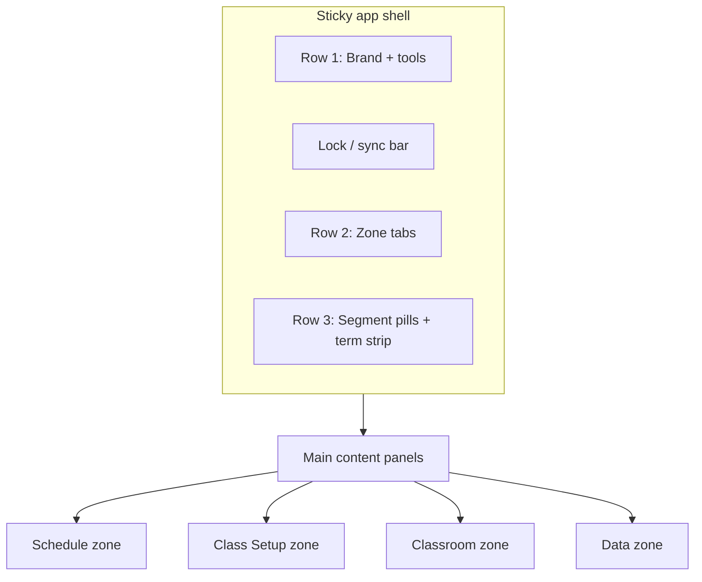

# ClassManager — Current Design & Layout Status

**Purpose:** Detailed, codebase-derived snapshot of how the app looks and is structured today. Paste this into Claude Design (with or without [`CLAUDE_DESIGN_BRIEF.md`](CLAUDE_DESIGN_BRIEF.md)) when you want redesigns grounded in the **actual** UI — not screenshots.

**Last aligned with codebase:** July 2026 (4-zone IA, classroom zone context bar, essay two-stage pipeline).

**Companion docs:**

| Doc | Use for |
|-----|---------|
| [CLAUDE_DESIGN_BRIEF.md](CLAUDE_DESIGN_BRIEF.md) | Tokens, colors, typography, component rules — design system spec |
| [UI_STYLE_GUIDE.md](UI_STYLE_GUIDE.md) | Implementation cookbook for developers |
| [Syllabus Style Guide.md](Syllabus%20Style%20Guide.md) | **Print/PDF syllabus only** — not on-screen UI |

---

## Product summary

**ClassManager** is a team calendar and curriculum planner for teachers (Korean + English). Teachers spend long sessions in calendars, class editors, cohort boards, classroom rosters, and syllabus tables.

**Design personality (implemented):** Calm professional productivity tool. Teal primary (`#14b98f`). IBM Plex Sans + Noto Sans KR. Light skeuomorphic chrome on zone/segment tabs. Tinted calendar chips (not loud solid blocks). Frosted sticky header. Bilingual labels throughout.

**Not:** Playful consumer app, neon gradients, or social-media aesthetic.

---

## Architecture at a glance

Single-page main app (`index.html`) + satellite pages. Vanilla JS (no React). CSS token system in `css/tokens.css` (+ partials merged into `styles.css`). State flows through `js/core/app-store.js` → `render-orchestrator.js` → view modules.



---

## Page inventory

| Page | Path | Role |
|------|------|------|
| **Main app** | `index.html` | All zones, calendar, editors, classroom |
| **Login hub** | `login.html` | Routes to password or Kakao login |
| **Password login** | `password-login.html` | Email/password sign-in |
| **Kakao login** | `kakao-login.html` | Kakao OAuth |
| **Pending access** | `pending-access.html` | Waiting for admin approval |
| **Help** | `help.html` + `help.css` | Searchable guide (`help/guide-content.json`) |
| **Admin** | `admin.html` + `admin.css` | Accounts, groups, calendars, system |
| **Day notes (mobile)** | `notes.html` | Journal-style day notes app |
| **Workspace stub** | `workspace.html` | Redirects to `/?zone=…&contentExpanded=1` |

All entry points use `viewport-fit=cover`, shared `styles.css`, `js/theme-init.js`, and `js/language-init.js`.

---

## Information architecture — zones & segments

Navigation is **two-level**: **zones** (top folder tabs) → **segments** (sub-tabs). Only one zone’s segment panel is visible. Segment rows **never wrap** — they scroll horizontally with edge fade hints on narrow screens.

### Zone 1: Schedule (`data-zone="schedule"`)

| Segment | Panel ID | Layout pattern |
|---------|----------|----------------|
| Calendar | `#panel-calendar` | Term settings (collapsible) + view toolbar + month grid |
| Events | `#panel-events` | Split: event list \| event editor |
| Command Center | `#panel-command-center` | 3-column: syllabus list \| day note \| homework copy (hidden by default in nav) |
| Homework copy | `#panel-homework` | Split: mini-calendar + class list \| copy-paste editor |
| Timetable | `#panel-timetable` | Teacher/cohort scope + period grid |

### Zone 2: Class Setup (`data-zone="classes"`)

| Segment | Panel ID | Layout pattern |
|---------|----------|----------------|
| All classes | `#panel-classes` | Split: class list \| class form |
| Cohorts | `#panel-cohorts` | Collapsible info + floating toolbar + setup board canvas + **class detail aside** (`#cohortsClassDetail`) |
| Teachers | `#panel-teachers` | **Placeholder card only** (links to Timetable / Cohorts) |
| Books | `#panel-curriculum` | Split: curriculum list \| book/session editor |
| Syllabi | `#panel-syllabus` | Split: class/template list \| syllabus table editor |

### Zone 3: Classroom (`data-zone="classroom"`)

| Segment | Panel ID | Layout pattern |
|---------|----------|----------------|
| Students | `#panel-students` | 3-column: cohort list \| student list \| student editor |
| Attendance | `#panel-attendance` | Sheet table (student × attendance × notes) |
| Ledger | `#panel-ledger` | Wide sheet (attendance + homework + points columns) |
| Homework | `#panel-homework-tracking` | Per-student homework tracking sheet |
| Points | `#panel-points` | Points sheet with reason picker |
| Tests | `#panel-tests` | Test scores sheet |
| Notes | `#panel-notes` | In-app class notes (desktop); phone redirects to `notes.html` |
| Portfolio | — | **Disabled / coming soon** (hidden segment) |

### Zone 4: Data (`data-zone="more"` — internal id; tab label **Data**)

| Segment | Panel ID | Layout pattern |
|---------|----------|----------------|
| Data | `#panel-data` | Calendar backup export/import sections |

**Data zone rule:** Admin **Data** only — segment tabs are never moved into Data.

---

## App shell — detailed layout

The shell lives in `#appTopBar` (sticky, `z-index: 200`, frosted glass). Content sits in `.app-container` with gutter `clamp(16px, 2vw, 32px)`.

### Visual structure (top → bottom)

```
┌──────────────────────────────────────────────────────────────────┐
│ VIEW-AS BANNER (fixed top, amber — admin impersonation only)      │
├──────────────────────────────────────────────────────────────────┤
│ UNIFIED HEADER CARD (.app-header-unified)                         │
│  ┌─ Row 1 PRIMARY ─────────────────────────────────────────────┐ │
│  │ ◳ ClassManager │ [spacer] │ 🔔 │ Calendar▾ Print Help ◐ Acct │ │
│  └───────────────────────────────────────────────────────────────┘ │
│  ┌─ LOCK/SYNC BAR (#teamLockSyncBar) ───────────────────────────┐ │
│  │ 🔒 lock skeuo badge │ label │ action │ Details │ saved dot    │ │
│  └───────────────────────────────────────────────────────────────┘ │
│  ┌─ Row 2 ZONES (.app-zone-nav) ────────────────────────────────┐ │
│  │ Schedule │ Class Setup │ Classroom │ Data                              │ │
│  └───────────────────────────────────────────────────────────────┘ │
│  ┌─ Row 3 SEGMENTS + TERM STRIP ─────────────────────────────────┐ │
│  │ [segment pills for active zone]     Term name · dates · settings│ │
│  └───────────────────────────────────────────────────────────────┘ │
├──────────────────────────────────────────────────────────────────┤
│ BANNER STACK (file-protocol warning, host engine panel)           │
└──────────────────────────────────────────────────────────────────┘
│ MAIN (#appMain) — active .app-tab-panel                           │
└──────────────────────────────────────────────────────────────────┘
│ TOAST RAIL (#appNoticeRail) — bottom/side transient messages      │
└──────────────────────────────────────────────────────────────────┘
```

### Row 1 — primary tools

- **Brand:** `◳` icon + “ClassManager” (`.app-brand-name`).
- **Calendar menu:** `#teamCalendarMenuBtn` — switch/create team calendars (popover).
- **My schedule:** `#headerMyScheduleBtn` — teacher-filtered view (role-gated).
- **Print:** `.btn-header-print` — blue-tinted button (`#eff6ff` / `#1d4ed8`).
- **Help:** link to `help.html`, outline style.
- **Theme:** `.btn-header-theme` — toggles `[data-theme="dark"]` on `<html>`.
- **Account:** avatar trigger → sign out, admin link, view-as (role-gated).
- **Notifications bell:** `#appWarningsBtn` — setup warnings inbox popover (`#tabWarningsPopover`).

### Lock / sync bar

Shown when team sync is active. Contains:

- Skeuomorphic padlock button (closed/open SVG states).
- Status chip label + primary action (Request edit / Release / etc.).
- Expandable **Details** drawer (who’s editing, pending requests, remote-newer conflict).
- **All changes saved** green dot (`#teamSyncSavedDot`).

Lock states use semantic tints: free (gray), held (green), blocked (red), pending (amber), waiting (blue).

### Zone tabs (`.app-zone-btn`)

- Folder-tab shape: rounded top, flat bottom, 3px **teal top rail** when active.
- Inactive: gray gradient `surface-elevated → bg-hover`.
- Active: white/card gradient, elevated shadow.
- Phone: horizontal scroll, 44px min touch height.

### Segment pills (`.app-zone-segment-btn`)

- Smaller folder tabs under the active zone.
- Same active/inactive skeuo pattern as zones.
- **Term summary strip** (`#termSummaryStrip`) sits right-aligned: term name, date range, month count, “Term settings ▸” link.

### Term settings (calendar only)

`#calendarOptions` — **collapsed by default** (`.calendar-options--collapsed`). Expands via term strip or `#termSummaryToggle`. Fields: calendar name, term start/end, auto end date, month count (3–6), day notes buttons.

---

## Screen-by-screen layout detail

### Calendar (`#panel-calendar`)

**Above the grid:**

1. Optional tab warnings strip (`#calendarTabTermWarn`).
2. **Calendar Filter** popover (`#lessonFilterPopover`) — visibility chips + class filter list with search.
3. Collapsible **term settings** (`#calendarOptions`).
4. **View toolbar** (`.calendar-view-toolbar`):
   - Month | Week | Agenda segment buttons (reuse `.syllabus-segment-btn` styling).
   - Filter button.
   - Zoom control (0.8×–1.4×, screen only).

**Calendar grid** (`#calendarContainer`):

- Month cards (`.month-calendar-card`) — one month ≈ one viewport height on desktop (`--calendar-month-view-height`).
- Day cells min-height **152px**; grid lines `--calendar-grid-line`.
- **Event chips** (`.event-bar--calm`):
  - Tinted fill at ~14% class color opacity.
  - **3px left color rail** in full class color.
  - 12.5px semibold title; 11px muted book/subtext.
  - Max **4 lessons/day**, then `+N more` link.
- Holidays: amber tint (`--holiday-bg` / `--holiday-border`).
- **Class filter rail** (`#calendarClassFilterRail`): borderless class-colored chips (`.calendar-class-chip`); inactive chips dim when filter active.

**Phone behavior:** Agenda default; Month button hidden; Week hidden in agenda mode.

**Calendar popout:** Clicking a day/class opens `#classModal` — centered popout with abbreviated class form (`data-editor-mode="popout"`).

---

### Events (`#panel-events`)

- Toolbar: “+ Add Event” (secondary button).
- **Split layout** (`.module-split-layout`):
  - Left: search + scrollable event list (`#eventList`).
  - Right: holiday/event form mount (`#holidayFormMountTab`) or empty hint.

---

### Homework copy (`#panel-homework`)

- **Working-from bar:** prominent “Working from {date}” + Today + one-line help (which lesson counts as this class).
- Toolbar: Expand view, Print daily summary, **Copy all N classes** (visible sidebar list).
- **Split layout** (`.module-split-layout--homework`):
  - **Sidebar:** mini month calendar, “Reload copy text from syllabi”, filter checkboxes, search, list summary counts, class list with **OPEN** badge on selected row.
  - **Editor:** Class queue (prev/next), class header, session chips, intro card + “Show how this works”, last-class notes + Copy note, **Two blocks → two sites**:
    - **① Grade now** — textarea + Copy (saves to syllabus hint).
    - **② Assign now** — due date + Copy date + textarea + Copy homework.
  - Copy both blocks footer.

**Command Center** homework column uses the same Grade/Assign block pattern (compact, read-only).

**Content pipeline stepper** (`#contentPipelineStepper`): optional 3-step banner (Books → Syllabi → Homework) when in expanded content workflow.

---

### Timetable (`#panel-timetable`)

- Scope controls (teacher / cohort filters) in header area.
- Conflict alert panel.
- Multi-grid mount (`#timetableGridsMount`) — period columns × cohort rows.

---

### Command Center (`#panel-command-center`)

- Hidden segment by default in production nav.
- **3-column** split on desktop; mobile tab switcher (`#commandCenterMobileTabs`).
- Panels: Syllabus progression list | Day note editor | Homework copy for selected session.

---

### All classes (`#panel-classes`)

- Toolbar: “+ Add Class” (primary).
- **Split layout:**
  - Left: search + `#classList` (listbox).
  - Right: `#classFormMountTab` or empty state.

**Class form** (`templates/class-form.html`) — shared DOM, two modes:

| Mode | Surface | Visible sections |
|------|---------|------------------|
| Popout | `#classModal` | Basics + schedule (hides `.form-group--full-only`) |
| Full tab | `#panel-classes` | All sections: appearance, teachers, cohorts, books, notes, custom schedule |

Field order: name → colors → curriculum → term dates → period/level/grade → total lessons → meeting days → *(full)* teacher, cohort, books, notes, compression.

**Class colors:** 12-color calm palette (`js/class-color-palette.js`); grid picker + live chip preview.

---

### Cohorts (`#panel-cohorts`)

- Collapsible **Cohort info** panel (tips, import from classes).
- **Floating toolbar:** + Add cohort, search, MWF | Tue/Thu | View all board switch.
- Contextual Edit / Delete when cohort selected.
- **Setup board canvas** (`#setupBoardViewMwf` / `#setupBoardViewTth`): draggable cohort columns, class cards, teacher assignment dropdowns, homeroom checkbox.
- **Class detail aside** (`#cohortsClassDetail`): period editor, print syllabus, open class editor — select a board card to populate. **Open timetable** link navigates to Schedule → Timetable (no embedded preview).

---

### Books / Curriculum (`#panel-curriculum`)

- Intro hint paragraph.
- **Split:** sidebar (Add curriculum, restore factory, search, list) | editor mount for session pages and defaults.

---

### Syllabi (`#panel-syllabus`)

- **Split:** sidebar with Classes | My syllabi segment toggle + lists | editor shell.
- **Editor actions bar:** Refresh from calendar/curriculum, print variants, ⋮ more menu, Save.
- **Body:** Title row, mode banner, schedule chip, syllabus table (`templates/syllabus-editor.html` mount).

On-screen syllabus editor uses standard app tokens — **not** the A4 print layout from Syllabus Style Guide.

---

### Classroom zone — common patterns

Most classroom tabs share:

- `#classroomZoneContextBar` — **shared class picker + session date + My classes / Essays-only toggles** (`js/classroom-zone-context.js`); persists across Attendance → Notes.
- `#classroom*Header` — tab-specific controls only (assignment picker, test fields, attendance stats); **no per-tab class or session date pickers**.
- `.module-toolbar.classroom-tab-toolbar` — primary actions (Save all, Mark all present, etc.) in `.toolbar-actions` right-aligned.
- `.classroom-sheet-panel` + `.classroom-sheet-scroll` — sticky-header tables.
- `.classroom-sheet` variants: `--attendance`, `--ledger`, homework, points, tests, essays.
- Row grammar: `.classroom-sheet-row` + optional `.classroom-sheet-row--status-rail` (3px left rail by status).

**Essays** (`#panel-essays`): assignment bar, collapsible deadlines strip (overdue pills), pipeline stat bar (progress + filter chips), two-stage Submission → Evaluation cells, conditional retest on Resubmit rows only. Reference mockup: `design/mockups/essays-redesign.html`.

**Students** uses **3-column** split: cohort list | student list (with bulk move) | student detail editor.

---

### Data (`#panel-data`)

- Sections with `.print-data-section` styling (tinted accent borders per category).
- Calendar backup: export/import JSON, read-only hint when locked.
- Curriculum link section (role-gated).

---

## Satellite page layouts

### Login (`login.html`)

- Centered card (max-width 420px) on `--bg-main`.
- Fixed top-right: language + theme toggles.
- Device choice fieldset (personal vs shared computer).
- Sign-in method list: Password, Kakao (yellow `#fee500` button).
- Optional Day notes link without full sign-in.

### Admin (`admin.html`)

- `.page-shell` layout with top nav (back, sign in, lang, theme).
- Tab bar: Accounts | Groups | Calendars | System | Monitor.
- Filter chips on accounts (All / Active / Waiting / Deactivated).
- Sticky admin tables (`.admin-table-wrap--sticky`).
- Separate `admin.css` for table density and access banners.

### Help (`help.html`)

- Same shell nav pattern as admin.
- Search input, auto-generated TOC, rendered markdown body from JSON.
- `help.css` for prose width and TOC styling.

### Day notes (`notes.html`)

- Mobile-first (`body.notes-page`).
- Compact header: back link, title, calendar label, lang/theme.
- Date bar: prev/next, date input, Today, “My classes · Today”.
- Class picker + rich text areas per class meeting.
- Banners: init error, remote newer, read-only, sync hint.

---

## Modals & overlays (main app)

| Modal ID | Size | Purpose |
|----------|------|---------|
| `#classModal` | Wide popout | Quick class edit from calendar |
| `#cohortEditorModal` | Scrollable wide | Cohort identity, subjects, links |
| `#conflictModal` | Small | Save conflict resolution |
| `#timetablePeriodModal` | Medium | Edit period times |
| `#termCloneModal` | Small | Clone term wizard |
| `#newCalendarModal` | Small | Create team calendar |
| `#deleteCalendarModal` | Small | Confirm delete |
| Print modal | Wide scrollable | Print options (tinted section tabs) |
| `#lessonFilterPopover` | Fixed popover | Calendar display filters |
| `#tabWarningsPopover` | Header popover | Notification inbox |
| Team calendar / account popovers | Dropdown panels | Calendar picker, account menu |

Modal pattern: `.modal` backdrop → `.modal-content` → `.modal-header` + `.modal-body`. Z-index `--z-modal` (1100). Toasts above at 1300.

---

## Design system — implementation status

### CSS organization

| File | Contents |
|------|----------|
| `css/tokens.css` | `:root` variables, reset, `body` base |
| `css/shell.css` | App container, top bar, header unified card |
| `css/components.css` | Buttons, forms, modals, chips |
| `css/calendar.css` | Calendar toolbar, term selector, grid helpers |
| `css/features.css` | Zone nav, classroom, setup board, dark theme, most feature UI |
| `css/index.css` | Imports partials (dev); `npm run css:split` maintains split |

**Rule:** New UI must use CSS variables — no ad-hoc hex in feature CSS.

### Typography (implemented)

- **UI:** IBM Plex Sans 16px body, 14px controls/buttons (weight 600).
- **Korean:** Noto Sans KR + Malgun Gothic fallbacks.
- **Scale:** `--text-h1` (48px) down to `--text-body-xs` (10px).

### Color (implemented)

| Role | Light | Dark |
|------|-------|------|
| Primary | `#14b98f` | `#1ed3a4` |
| Page BG | `#f4f6f9` | `#0e1726` |
| Card | `#ffffff` | `#111c2c` |
| Text primary | `#1c2430` | `#e8edf4` |
| Border | `#e3e8ef` | `#232f44` |

Full token list: `css/tokens.css` + `[data-theme="dark"]` block in `css/features.css` (~line 6162).

### Buttons (implemented)

- Base `.btn` — 40px min-height, 8px radius, weight 600.
- Variants: primary (teal), secondary (slate), outline, danger.
- Sizes: `.btn-small` / `.btn-compact` (36px), `.btn-lg` (48px).
- Header tints: print (blue), lang (purple), theme (slate).

### Forms (implemented)

- `.form-group` — label above control.
- `.form-row` — two-column on desktop.
- `.field-input`, `.field-select`, `.field-control` — 8px radius, teal focus ring.
- `.selection-chip` — bordered checkbox tiles for catalogs.
- `.lesson-filter-chip` / `.calendar-class-chip` — borderless, color-driven.

### Cards & toolbars

- White cards on gray page background.
- `.module-toolbar` — horizontal action row above split layouts.
- `.module-split-layout` — list panel (min ~220px) + editor panel pattern used across Classes, Events, Homework, Syllabus, Curriculum, Classroom roster.

### Motion (implemented)

- Button hover: 200ms, `translateY(-1px)` on primary.
- Toast in/out: 420ms / 320ms with custom easing.
- Zone scroll affordance fades: JS-driven `data-scrollable` attributes.

---

## Responsive behavior (implemented)

`html[data-viewport]` set by JS: `phone` | `tablet-sm` | `tablet` | `desktop`.

| Breakpoint | Width | Key behavior |
|------------|-------|--------------|
| Phone | ≤640px | Agenda default, 44px touch targets, horizontal tab scroll |
| Small tablet | 641–900px | Compact split layouts |
| Tablet | 901–1024px | Touch targets, some stacking |
| Desktop | >1024px | Full month view, 36px compact controls OK |

**Mobile setup banner:** `#mobileSetupLimitedBanner` on cohorts/setup-heavy tabs.

**Notes on phone:** Classroom Notes segment redirects to `notes.html`; label becomes “Day notes”.

---

## Notifications & status (implemented)

| Lane | Element | Use |
|------|---------|-----|
| Toast rail | `#appNoticeRail` | Save/sync/lock flashes (`CCPNotice`) |
| Bell inbox | `#appWarningsBtn` + popover | Dismissible setup warnings |
| Lock/sync | `#teamLockSyncBar` | Live collaboration state |
| View-as | `#viewAsBanner` | Admin impersonation (amber, top) |
| File protocol | `#openFromDriveBanner` | Wrong open method alert |
| Inline | `.section-hint`, tab warning strips | Contextual hints |

---

## Internationalization (implemented)

- English default; Korean via `js/i18n/calendar-ko.js` (lazy-loaded).
- `data-i18n` attributes on shell and templates.
- Language toggle on login, help, admin, notes, and main header (via account/settings).
- Layout must accommodate longer Korean strings in tabs and buttons.

---

## Class color system (implemented)

Curated 12-color palette (blues, greens, purple, orange, teal, slate). Chips use:

- Light: 16% fill alpha, `#243244` text.
- Dark: 20% fill, lightened accent, `#dde6f1` text.

Used on: calendar events, filter chips, class color picker, setup board cards.

---

## Incomplete / placeholder areas

Designers should know these are **not** fully built UI:

| Area | Status |
|------|--------|
| Teachers tab (`#panel-teachers`) | Placeholder card with links only |
| Classroom Portfolio segment | Disabled, hidden, “Coming soon” |
| Command Center segment | Hidden in default nav (feature-flag style) |
| `workspace.html` | Redirect stub only |

---

## Print vs on-screen (important)

- **On-screen UI:** This document + `CLAUDE_DESIGN_BRIEF.md`.
- **Syllabus A4 print/PDF:** Separate rules in `Syllabus Style Guide.md` (two-table 진도표, paper margins). Do not mix print layout into editor mockups.

Print modal uses tinted section tabs (options=blue, books=green, lessons=purple, data=red) — distinct from main nav colors.

---

## How to use with Claude Design

**Full redesign package — paste in this order:**

1. This file (`CLAUDE_DESIGN_STATUS.md`) — what exists and how it’s laid out.
2. [`CLAUDE_DESIGN_BRIEF.md`](CLAUDE_DESIGN_BRIEF.md) — tokens and component rules.
3. Your specific ask, for example:

> “Redesign the Setup Hub three-pane layout for tablet. Keep the zone/segment shell and teal brand. Propose light + dark.”

> “Improve Classroom Students 3-column layout for phone without losing cohort context.”

**Optional:** Add screenshots from https://classmanager.live or local `npm start` for pixel reference. This doc replaces screenshots for structure and inventory.

---

## Source file quick map

| Concern | Path |
|---------|------|
| Main shell HTML | `index.html` |
| Design tokens | `css/tokens.css` |
| Shell chrome CSS | `css/shell.css`, `css/features.css` (zones) |
| Calendar UI CSS | `css/calendar.css`, `css/features.css` (chips) |
| Class form template | `templates/class-form.html` |
| Syllabus editor template | `templates/syllabus-editor.html` |
| Class colors | `js/class-color-palette.js` |
| Zone navigation JS | `app.js` (`syncZoneNavScrollAffordance`, zone dispatch) |
| View renders | `js/views/calendar-view.js`, `class-list-view.js`, `event-list-view.js` |
| Theme toggle | `js/theme-init.js`, `js/theme-toggle.js` |
| Page chrome / toasts | `js/page-chrome.js` |
| Modals | `js/ui/modal.js` |

---

*Generated from codebase structure and CSS — June 2026. Update this file when zones, shell layout, or major panel patterns change.*
