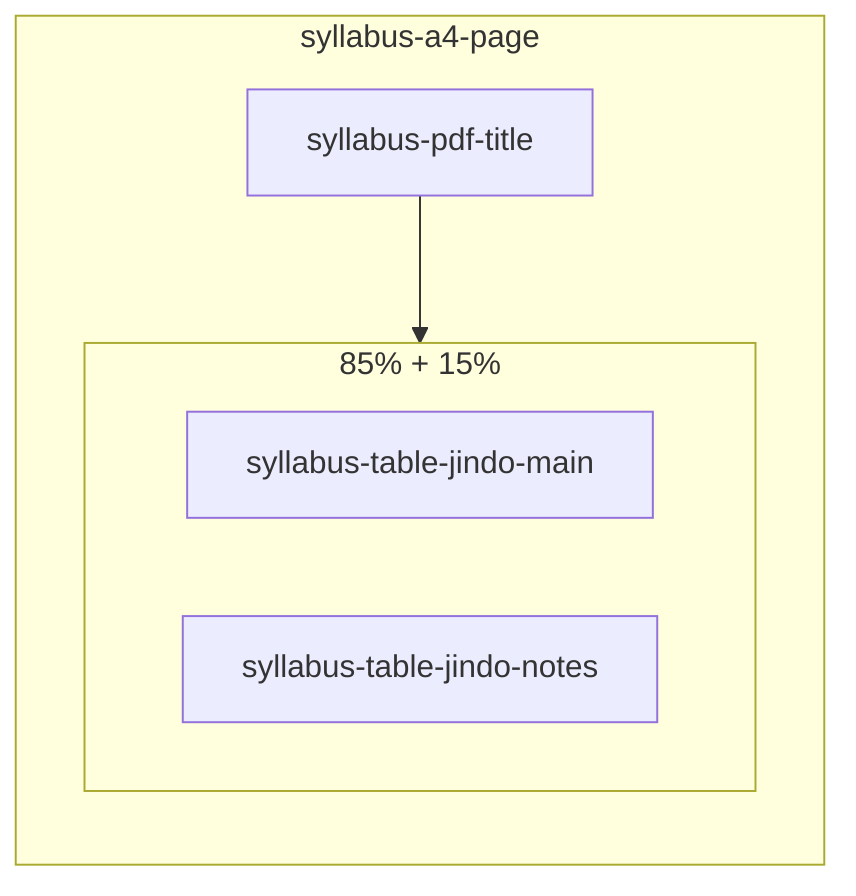

# Syllabus Style Guide

How the **진도표 (jindo) syllabus print** layout is built, fitted to A4, and kept in sync with the reference PDF (e.g. *26 SP Green-Blue RC 진도표 [M반] (수금)_완.pdf*).

Use this document when recreating or debugging print/PDF output—not the on-screen syllabus editor table.

---

## Reference model

The target layout is a single A4 portrait page per class with:

| Area | Content |
|------|---------|
| **Title** | Class name (e.g. `Garam T-GR · [Thu]`) |
| **Main schedule (left, ~85%)** | Year header + month/week merges + one row per lesson |
| **Notes (right, ~15%)** | Header **비고 / Note** + one tall cell for **general notes only** |

```text
┌─────────────────────────────────────────────────────────────┬──────────┐
│ 2026년 │ Week │ Date │ Lesson plan                          │ Note     │  ← header row (aligned heights)
├────────┼──────┼──────┼──────────────────────────────────────┼──────────┤
│ 3월    │ 1주  │ 3/4  │ OT + Unit 1                          │          │
│        │      │ 3/6  │ Unit 2 (1/2)                         │  General │
│        │ 2주  │ 3/11 │ Unit 2 (2/2)                         │  notes   │
│        │      │ ...  │ ...                                  │  (비고)  │
│ 4월    │ ...  │ ...  │ ...                                  │          │
└────────┴──────┴──────┴──────────────────────────────────────┴──────────┘
         ↑ main table (4 columns)                                  ↑ separate
                                                                 2-row table
```

**Not** one HTML table with five columns. Notes are a **sibling table** so row heights in the schedule are never stretched by long note text.

---

## Architecture (two tables)



### Main table (`syllabus-table-jindo-main`)

- **Columns:** Year (header) / Month (merged) | Week (merged) | Date | Lesson plan  
- **No Note column** in this table.  
- **Plan cells:** title only (`renderPlanCellJindo`)—no homework/covered lines on the overview sheet.  
- **Row filter:** `filterRowsForPdfPrint()` before render (see below).

### Notes table (`syllabus-table-jindo-notes`)

- **Two rows total:**  
  1. `<thead>` — one `<th>` (label from `L.colNote`, e.g. 비고)  
  2. `<tbody>` — one `<td class="syllabus-jindo-notes-body-cell">` with `<div class="syllabus-jindo-note-body">`  
- **Content:** `buildPrintGeneralNotesHtml()` → class/curriculum general notes, `white-space: pre-wrap`.  
- **Height:** synced to main table after fit (`syncJindoNotesTableHeight()`): header height = main `<thead>`, body height = main `<tbody>`.

### Wrapper

- `.syllabus-jindo-print-grid` — flex row, **2px outer border**, `overflow: hidden`.  
- Inner tables use `border-collapse: collapse`; shared edges use single 1px lines (no double border between main and notes).

---

## Widths (constants)

Defined in [`js/syllabus-table.js`](js/syllabus-table.js):

| Constant | Value | Role |
|----------|-------|------|
| `SYLLABUS_JINDO_MAIN_GRID_WIDTH` | `85%` | Main schedule block |
| `SYLLABUS_JINDO_NOTES_COL_WIDTH` | `15%` | Notes side table |
| `SYLLABUS_JINDO_MAIN_COL_WIDTHS` | `11%`, `9%`, `10%`, `70%` | Month, week, date, plan (% of **main** grid) |

Month / week / date use `white-space: nowrap` on jindo main table so labels like `3월`, `W1`, `3/11` do not wrap.

---

## What prints in Notes vs what does not

| Source | Printed on 진도표? |
|--------|-------------------|
| **General notes** (curriculum or class `syllabusGeneralNotes`) | Yes — right column only |
| **Per-lesson `row.note`** in the syllabus editor | **No** — homework workflow only |
| **Editor `kind: 'note'` rows** (e.g. “Each unit is one week”) | **No** — filtered out |
| **Overflow intro rows** | **No** |
| **Homework / covered in plan detail** | **No** on overview (optional appendix via print checkbox) |

Resolver: `resolvePrintGeneralNotes(classData, labels)` → class override, then `CCPBooksEditor.resolveSyllabusGeneralNotesForClass`, then labels.

---

## Row rules (main table)

1. **`filterRowsForPdfPrint(rows)`** — runs when `pdfLayout === true`.  
2. **`computeJindoCellMerges()`** — month labels in column 1 (merged per month); week labels `1주` / `W1` (merged per school week, resets each calendar month).  
3. **Dates** — `M/D` in date column (`formatJindoDateMd`).  
4. **Special rows** — holidays/events keep row background colors from `rowBg` / `rowColor` (e.g. level test red, evaluation purple).  
5. **Equal row heights** — `stretchJindoMainTable()` divides tbody height evenly across lesson rows.

---

## Fit to one A4 page

Pipeline: `fitSyllabusPagesToA4()` → `scaleSyllabusPageToFit()` → `applyStretchForPrint()`.

For jindo:

1. **`stretchJindoPrintLayout()`** — sets grid height; stretches main tbody rows evenly; syncs notes table heights.  
2. **Typography — two scales:**  
   - `lessonGroupScale` — year/month/week/date/plan (and page title)  
   - `noteScale` — notes table only (can shrink without shrinking lesson columns)  
3. **Floor:** `SYLLABUS_PRINT_SCALE_FLOOR` (0.78).  
4. **Emergency:** if both scales hit floor and page still overflows, light `transform: scale()` on the page.

Do **not** put note content in a rowspan cell inside the main table—that caused the first row to balloon and blank space in lesson columns.

---

## Key files

| File | Responsibility |
|------|----------------|
| [`js/syllabus-table.js`](js/syllabus-table.js) | Render HTML, `A4_PDF_CSS`, merge logic, fit/stretch, notes side table |
| [`js/load-extension-scripts.js`](js/load-extension-scripts.js) | Cache-bust `?v=` on `syllabus-table.js` |
| [`app.js`](app.js) | `getSyllabusTableLabels()` (`jindoTable: true`), print preview, `fitSyllabusInPrintWindow()` |
| [`styles.css`](styles.css) | Print preview under `#syllabusTablesSummary` (mirror jindo grid borders/widths) |
| [`index.html`](index.html) / print flow | Syllabus tables in summary print document |

Legacy non-jindo PDF (`jindoTable: false`) still uses one table with a merged note column and 2-line plan briefs—different code path.

---

## Important functions (quick index)

| Function | Purpose |
|----------|---------|
| `isJindoPdfLayout(labels)` | `jindoTable === true` (default for A4 print labels in app) |
| `filterRowsForPdfPrint(rows)` | Drop note/overflow/empty rows before print |
| `buildPrintGeneralNotesHtml(notes)` | Escape general notes text |
| `buildPrintNotesColumnHtml(notes)` | Wrap in `.syllabus-jindo-note-body` |
| `renderJindoNotesSideTableHtml(header, body)` | 2-row notes table markup |
| `renderSyllabusTableHtml(...)` | Main table + grid wrapper + side notes table |
| `stretchJindoPrintLayout(pageEl, ...)` | Equal row heights + height sync |
| `applySyllabusTypographyScale(pageEl, lessonScale, noteScale)` | Independent font sizes |
| `getSyllabusExportStyles(true)` | Inline CSS for PDF/print window |

---

## Enabling jindo print (labels)

In [`app.js`](app.js), `getSyllabusTableLabels()` sets:

```javascript
jindoTable: true,
pdfLayout: true,
a4Pdf: true,
// colYear, colWeek, colDate, colPlanJindo, colNote, useKoreanJindo, tableYear, jindoTitle, …
```

Print preview calls `CCPSyllabus.fitSyllabusPagesToA4(printWin.document, SYLLABUS_PDF_A4)` after sheets render.

---

## Local test checklist

1. `.env` with `ALLOW_OPEN_ACCESS=1` (local only).  
2. `npm start` → http://localhost:8080 (**not** file:// or Live Server alone).  
3. **Ctrl+F5** after changing `syllabus-table.js` (check Network for current `?v=`).  
4. Open a class with many lessons + long general notes (비고).  
5. Print syllabus / summary with syllabus tables enabled.  

**Expect:**

- No extra first row with “Lesson plan” / editor note text in the schedule.  
- First lesson row = first real date (e.g. Jun W1 6/4).  
- Notes column ~15% wide; plan column widest.  
- Crisp single borders between cells; no gap between main and notes.  
- Row heights even in main table; notes text at top of right column.

**Automated tests:**

```bash
node tests/syllabus-table.test.mjs
```

---

## Deploy / cache

1. Test locally with `npm start`.  
2. Bump `js/syllabus-table.js?v=` in [`js/load-extension-scripts.js`](js/load-extension-scripts.js).  
3. `npm run deploy` (production uses built `dist/` + worker—git push alone does not update live).  
4. Hard refresh browsers on print preview.

API changes are client-only for this layout; worker/server only if you add new endpoints.

---

## Recreating from scratch (checklist)

If the layout regresses, restore in this order:

1. **Side-by-side tables** — `syllabus-jindo-print-grid` + `renderJindoNotesSideTableHtml`; remove Note `<td>` from main jindo tbody.  
2. **85% / 15%** — flex widths on main and notes tables; `SYLLABUS_JINDO_MAIN_COL_WIDTHS`.  
3. **`filterRowsForPdfPrint`** — no editor note rows in print body.  
4. **General notes only** — `buildPrintGeneralNotesHtml`; do not use `buildMergedNotesHtml` with per-row notes for jindo.  
5. **Borders** — `border-collapse: collapse` on both tables; one 2px border on grid; trim top/bottom/left/right on outer cells.  
6. **Fit** — `stretchJindoPrintLayout` + `syncJindoNotesTableHeight`; avoid rowspan note cell in main table.  
7. **Two-scale typography** — lesson group first, then note scale.  
8. **Print preview CSS** — duplicate critical rules under `#syllabusTablesSummary` in `styles.css`.  
9. **Tests** — extend `tests/syllabus-table.test.mjs` jindo block for grid, no note in main tbody, `filterRowsForPdfPrint`.

---

## Related product copy

`app.js` string `syllabusGeneralNotesHint` states that general notes print in the Note column and per-lesson table notes are not printed—keep that accurate if UX strings change.

---

*Last aligned with implementation: June 2026 (`syllabus-table.js` cache `20260604-print-rows-borders` or later).*
